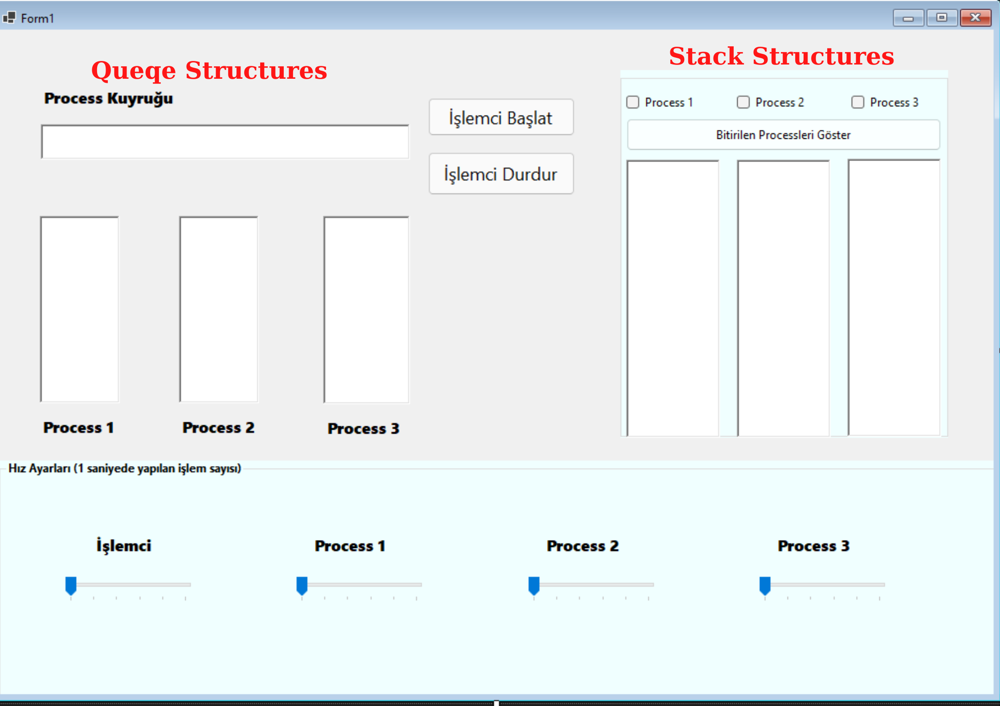
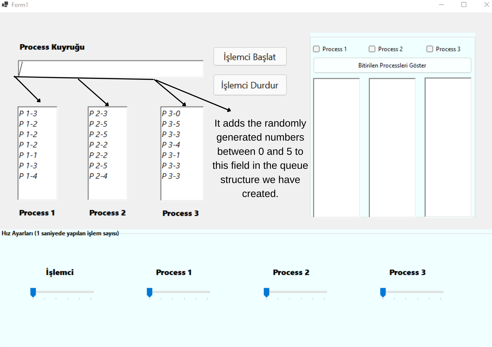
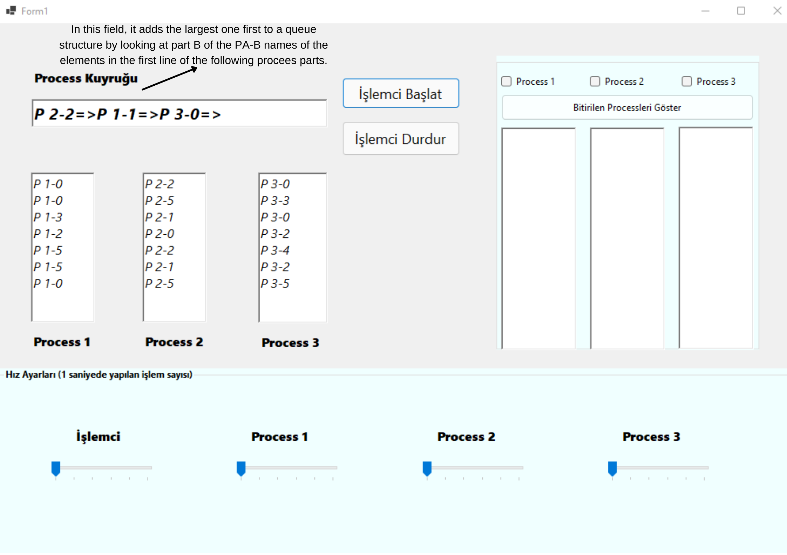
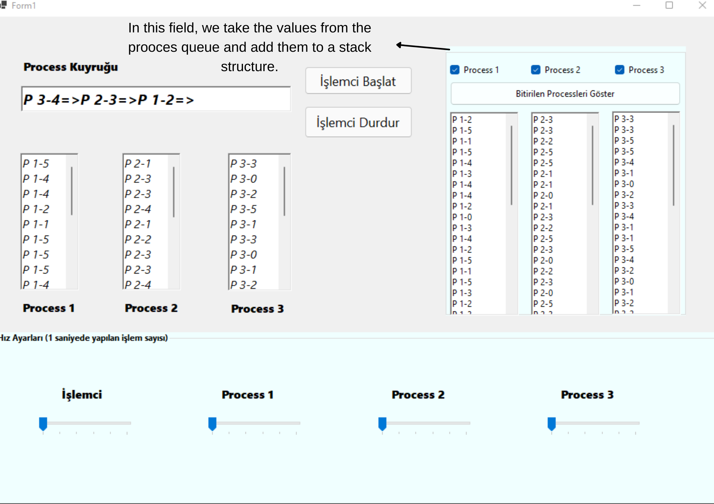

# Stack-and-Queqe-Structure

### - It adds the randomly generated numbers between 0 and 5 to this field in the queue structure we have created.

### - In this field, it adds the largest one first to a queue structure by looking at part B of the PA-B names of the elements in the first line of the following procees parts.

### - In this field, we take the values from the prooces queue and add them to a stack structure.

